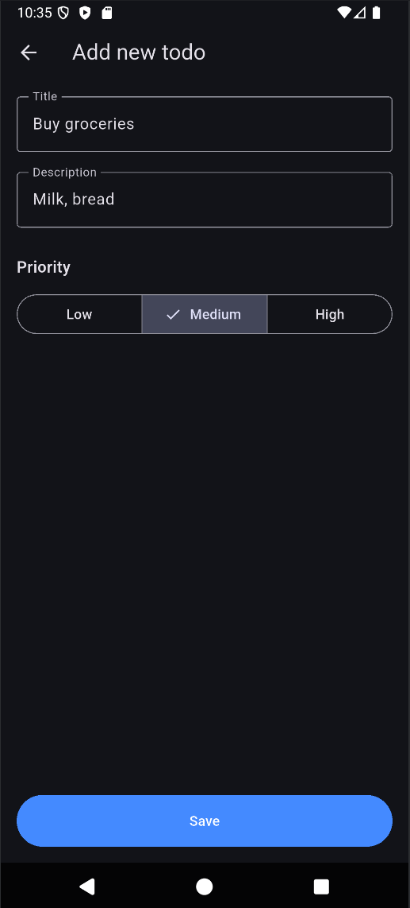

# Flutter todo app

This is my first Flutter project, created for learning purposes.

**Work in Progress**

### Current features
- Basic UI
- Local database using **Drift**
- Sorting todos by priority
- Adding new todos

### Planned
- User statistics
- Sorting todos by priority
- Options to delete and update todos
- UI improvements

### Screenshots

    
    

